<div align="center">

# 🎓 SkillVerse

## Advanced AI-Powered E-Learning & Career Mastery Platform

*A modern, feature-rich, production-grade E-learning and interview preparation platform designed to deliver a personalized, accessible, and career-focused learning experience.*

[](https://www.typescriptlang.org/)
[](https://react.dev/)
[](https://vitejs.dev/)
[](https://tailwindcss.com/)
[](https://firebase.google.com/)
[](https://web.dev/progressive-web-apps/)
[](https://react.i18next.com/)
[](LICENSE)

</div>

---

# 📖 Overview

**SkillVerse** simulates a **real-world SaaS educational product**, combining structured curriculum learning, interactive coding, voice & text AI mock interviews, spaced repetition flashcards, gamification, and verified certifications.

It is built with a **product-first mindset**, prioritizing:
- **Resilient Frontend Architecture**: Zero-crash defensive storage, cloud hydration, and dynamic chunk optimization.
- **Deep Personalization & Accessibility**: Inclusive typography (OpenDyslexic), reduced motion, font scaling, and multi-language support (including Right-to-Left Arabic).
- **Career Readiness**: Real tech company interview questions, AI-powered mock interviews with instant feedback reports, and industry skill benchmark analysis.

---

# ✨ Comprehensive Feature Matrix

### 📚 1. Structured Courses & Interactive Learning
- **Rich Course Content**: Structured chapters and lessons covering Programming, Data Structures & Algorithms, and System Design.
- **Interactive Quizzes**: Instant feedback, cooldown timers on failed attempts, and AI explanations (*"Ask AI Why"*).
- **Course Filters & Bookmarks**: Filter courses by **Difficulty** (Beginner, Intermediate, Advanced) and **Duration**, with a dedicated **Saved Courses (`/saved`)** collection.
- **Lesson Notes & Discussions**: Rich community comments with upvoting and personal lesson note-taking with PDF export.

### 💼 2. Career Mode & AI Mock Interviews
- **20+ Top Tech Companies**: Curated question banks for Google, Meta, Amazon, Microsoft, Netflix, Apple, Uber, and more.
- **AI-Powered Mock Interviews**: Real-time voice and text mock interviews powered by **Gemini AI (via OpenRouter)** with automated speech-to-text (STT) and text-to-speech (TTS).
- **Comprehensive PDF Feedback**: Generates high-DPI downloadable PDF reports summarizing readiness score, technical strengths, improvement areas, and code critique.

### ⚡ 3. Daily Coding Challenge & Spaced Repetition (SRS)
- **Daily Challenge Room**: 3 randomized daily questions rotating dynamically with daily mastery multipliers and bonus XP rewards.
- **Leitner Box Spaced Repetition System (SRS)**: Adaptive review scheduling (1, 3, 7, 14, 30 days) to maximize long-term question retention.

### 💻 4. Interactive In-Browser Coding Playground
- **Multi-Language Playground**: Code in JavaScript, Python, C++, and Java directly in the browser.
- **Execution & Output**: Real-time console execution, automated test case evaluation, and code reset capabilities.

### 📊 5. Skill Profile & Gap Analysis
- **Dynamic Radar Chart**: Visualizes user competence across Programming, DSA, and System Design using Recharts.
- **Benchmark Comparisons**: Compare personal skills against **Top 10% Industry Average** or **Senior Engineer Target**.
- **Role Gap Breakdown**: Identifies target skill deficits and recommends tailored course paths.

### 🎓 6. Verifiable Certifications & LinkedIn Sharing
- **High-DPI PDF Certificates**: Auto-generated certificates of completion with unique verifiable tokens.
- **Credential Verification (`/credential/:token`)**: Standalone public verification page.
- **1-Click LinkedIn Sharing**: Direct integration to add earned certifications to LinkedIn profiles.

### 🌐 7. Internationalization (i18n) & Arabic RTL Layout
- **12 Supported Languages**: English, Hindi, Spanish, French, German, Arabic, Chinese, Japanese, Korean, Portuguese, Russian, and Italian.
- **Bidirectional RTL Support**: Complete layout mirroring (sidebars, drawers, modals, charts) when Arabic is selected.

### 📱 8. Progressive Web App (PWA) & Offline Mode
- **Installable Desktop & Mobile App**: Built with `vite-plugin-pwa` and Workbox.
- **Offline Reliability**: Cached courses, quizzes, and translations allow learning even with intermittent connectivity.

### ♿ 9. Accessibility & Personalization Suite
- **Dyslexia-Friendly Mode**: OpenDyslexic typeface toggle for enhanced readability.
- **Font Scaling**: Adjustable font sizes (Small, Medium, Large).
- **Reduced Motion**: System-aware and manual toggle for motion sensitivity.
- **Keyboard Shortcuts & Modal**: Press `?` anywhere to view keyboard shortcuts.

### ⌨️ 10. Command Palette (`Ctrl/Cmd + K`)
- **Universal Quick Actions**: Instant fuzzy search across courses, pages, bookmarks, and settings.

### 💾 11. Data Portability & Resilient Storage
- **Local Backup & Restore**: Export and import complete learning history as `skillverse-backup-YYYY-MM-DD.json` with schema validation and Merge/Replace options.
- **Defensive Storage Engine (`safeStorage.ts`)**: Crash-free JSON handling, quota protection, and in-memory session fallback for restricted/private browser environments.

### ⏰ 12. Study Reminders & Learning Analytics
- **Custom Browser Notifications**: Configurable daily study reminder alerts (`useStudyReminders`).
- **Weekly Target Tracker**: Daily study time logging with interactive weekly goal progress bars.
- **Course Progress Reports**: Export full learning history and quiz scores as downloadable PDF or JSON.

### 🛍️ 13. Gamification, Badges & XP Store
- **XP & Level Progression**: Earn XP through courses, quizzes, mock interviews, and daily challenges.
- **XP Store**: Spend earned XP on avatar frames, custom primary color themes, and **Streak Freezes** to protect daily streaks.
- **Real-Time Leaderboard & Social Feed**: Global rankings, follow learners, and send Kudos.
- **Shareable Public Profiles (`/u/:username`)**: Standalone public profile pages to showcase badges, XP, certificates, and learning stats.

---

# 🏗 Architecture

```mermaid
graph TD
    %% Styling Themes
    classDef client fill:#f8fafc,stroke:#94a3b8,stroke-width:2px,color:#0f172a;
    classDef hosting fill:#f0f9ff,stroke:#0ea5e9,stroke-width:2px,color:#0f172a;
    classDef module fill:#ffffff,stroke:#bae6fd,stroke-width:1px,color:#0f172a;
    classDef firebase fill:#fff7ed,stroke:#f97316,stroke-width:2px,color:#0f172a;
    classDef external fill:#f0fdf4,stroke:#22c55e,stroke-width:2px,color:#0f172a;
    classDef storage fill:#fdf4ff,stroke:#c084fc,stroke-width:2px,color:#0f172a;

    Client(["💻 Client Browser / PWA"]):::client

    subgraph FrontendApp ["🌐 Frontend Application (React + Vite SPA)"]
        Router["App.tsx (React Router)"]:::module
        
        subgraph Core_Modules ["Core Feature Modules"]
            LandingModule["LandingPage & Onboarding"]:::module
            DashModule["Dashboard & SkillRadarChart"]:::module
            CoursesModule["CoursesList, CourseView & Filters"]:::module
            PlaygroundModule["CodingPracticePlayground"]:::module
            CareerModule["CareerMode (Mock Interviews & SRS)"]:::module
            CertModule["Certificates & CredentialVerification"]:::module
            ProfileModule["PublicProfilePage (/u/:username)"]:::module
            SettingsModule["Settings, Accessibility & DataPortability"]:::module
            CommandModule["CommandPalette & Shortcuts"]:::module
        end

        subgraph Client_State ["Client State & Storage Layer"]
            AuthCtx["AuthContext & InstallPromptContext"]:::module
            SafeStore["safeStorage.ts & dataPortability.ts"]:::storage
            ServiceWorker["PWA Service Worker (Workbox)"]:::storage
        end
    end

    subgraph FirebaseCloud ["🔥 Firebase Backend Services"]
        FirebaseAuth["Firebase Authentication"]:::firebase
        Firestore["Firestore NoSQL Database"]:::firebase
        FirebaseStorage["Cloud Storage (Avatars)"]:::firebase
    end
    
    subgraph ExternalServices ["🔗 External & Native APIs"]
        OpenRouter["OpenRouter AI (Gemini Flash/Pro)"]:::external
        WebSpeech["Web Speech API (TTS / STT)"]:::external
        PDFEngine["jsPDF & html2canvas"]:::external
        i18nEngine["i18next (12 Locales + RTL)"]:::external
    end

    %% Client Entry Point
    Client --> ServiceWorker
    ServiceWorker --> Router

    %% Routing
    Router --> LandingModule
    Router --> DashModule
    Router --> CoursesModule
    Router --> PlaygroundModule
    Router --> CareerModule
    Router --> CertModule
    Router --> ProfileModule
    Router --> SettingsModule
    Router --> CommandModule

    %% State & Persistence Connections
    DashModule <--> AuthCtx
    SettingsModule <--> SafeStore
    CoursesModule <--> SafeStore
    CareerModule <--> SafeStore
    
    %% Cloud & External Integrations
    AuthCtx <--> FirebaseAuth
    AuthCtx <--> Firestore
    CareerModule <--> OpenRouter
    CareerModule <--> WebSpeech
    CertModule --> PDFEngine
    SettingsModule --> i18nEngine
    SettingsModule <--> FirebaseStorage
```



---

# 🛠 Tech Stack

| Category | Technology | Purpose |
| :--- | :--- | :--- |
| **Frontend Framework** | [React 18](https://react.dev/) | Component-based UI architecture |
| **Language** | [TypeScript](https://www.typescriptlang.org/) | Strict type safety and maintainability |
| **Build Tool & Bundler** | [Vite 6](https://vitejs.dev/) | Fast HMR, Rollup manual chunking & code splitting |
| **Styling & Design** | [Tailwind CSS](https://tailwindcss.com/) | Glassmorphism, dark/light themes, responsive layout |
| **PWA & Offline** | [vite-plugin-pwa](https://vite-pwa-org.netlify.app/) / [Workbox](https://developer.chrome.com/docs/workbox) | Service worker precaching, offline route & data caching |
| **Internationalization** | [i18next](https://www.i18next.com/) & [react-i18next](https://react.i18next.com/) | 12-language localization, RTL layout adaptation |
| **Data Visualization** | [Recharts](https://recharts.org/) | Dynamic Skill Profile Radar Charts & Analytics |
| **Authentication** | [Firebase Auth](https://firebase.google.com/docs/auth) | Email/Password, Google, and GitHub OAuth |
| **Database** | [Cloud Firestore](https://firebase.google.com/docs/firestore) | Real-time NoSQL cloud database |
| **AI Evaluation** | [OpenRouter](https://openrouter.ai/) (Gemini Model) | Mock interview feedback, quiz explanations, and coaching |
| **PDF Generation** | [jsPDF](https://github.com/parallax/jsPDF) & [html2canvas](https://html2canvas.hertzen.com/) | High-DPI certificates, interview reports, and note exports |
| **Icons & Media** | [Lucide React](https://lucide.dev/) | Clean, lightweight SVG iconography |
| **Sanitization** | [DOMPurify](https://github.com/cure53/DOMPurify) | XSS prevention for rich text and lesson content |

---

# 📸 Screenshots

## Landing Page


---

## Dashboard & Skill Radar


---

## Courses & Category Explorer


---

## Career Mode & Mock Interviews


---

## Verified Certifications


---

## Settings, Accessibility & Data Portability


---

# ⚙️ Installation & Setup

### 1. Clone the repository
```bash
git clone https://github.com/Khushi1310-nayak/SkillVerse.git
cd SkillVerse
```

### 2. Install dependencies
```bash
npm install
```

### 3. Configure environment variables
Copy the example environment file:
```bash
cp .env.example .env
```

Fill in your Firebase and OpenRouter credentials in `.env`:
```env
# Firebase Configuration
VITE_FIREBASE_API_KEY=your_firebase_api_key
VITE_FIREBASE_AUTH_DOMAIN=your_project.firebaseapp.com
VITE_FIREBASE_PROJECT_ID=your_project_id
VITE_FIREBASE_STORAGE_BUCKET=your_project.appspot.com
VITE_FIREBASE_MESSAGING_SENDER_ID=your_sender_id
VITE_FIREBASE_APP_ID=your_app_id

# AI Mock Interviews & Assistant (OpenRouter)
VITE_OPENROUTER_API_KEY=your_openrouter_api_key
```

### 4. Start the development server
```bash
npm run dev
```

### 5. Build for production
```bash
npm run build
npm run preview
```

---

# ⌨️ Keyboard Shortcuts & Command Palette

SkillVerse includes built-in power-user navigation:

| Shortcut | Action |
| :--- | :--- |
| `Ctrl + K` / `Cmd + K` | Open **Universal Command Palette** |
| `?` | Open **Keyboard Shortcuts Help Modal** |
| `Esc` | Close active modal, drawer, or dialog |
| `Tab` / `Shift + Tab` | Accessible keyboard focus navigation with focus traps |

---

# 🤝 Contributing

Contributions are warmly welcomed! Please read our [`CONTRIBUTING.md`](CONTRIBUTING.md) before submitting Pull Requests.

1. **Claim an Issue**: Request assignment on an open issue before writing code.
2. **Fork & Branch**: Create a feature branch (`git checkout -b feat/your-feature-name`).
3. **Commit**: Write clean, conventional commit messages.
4. **Test**: Run `npm run build` to verify strict TypeScript compilation and 0 lint errors.
5. **Open a PR**: Submit a pull request referencing the assigned issue.

---

# 🌟 Contributors

Thank you to everyone who has contributed to making SkillVerse better!

<a href="https://github.com/Khushi1310-nayak/SkillVerse/graphs/contributors">
  
</a>

---

# 📜 License

This project is licensed under the **MIT License**. You are free to use, modify, and distribute it with attribution.

---

# 👩‍💻 Author

## **Manisa Nayak**

🎓 Student | Full-Stack Developer | AI Product Builder

- **GitHub:** [@Khushi1310-nayak](https://github.com/Khushi1310-nayak)  
- **LinkedIn:** [Manisa Nayak](https://www.linkedin.com/in/manisa-nayak-185bb5378/)

---

<div align="center">
⭐ <b>If you find SkillVerse helpful, please give it a Star on GitHub!</b> ⭐
</div>
