<div align="center">

# SkillVerse

### Technical E-Learning, Interactive Coding & Career Preparation Platform

An open-source single-page web application providing structured technical courses, a multi-language in-browser coding sandbox, an algorithm visualizer, real-time pair programming, and AI-assisted technical mock interviews.

---

[](https://react.dev/)
[](https://www.typescriptlang.org/)
[](https://vitejs.dev/)
[](https://tailwindcss.com/)
[](https://firebase.google.com/)
[](https://microsoft.github.io/monaco-editor/)
[](https://web.dev/progressive-web-apps/)
[](https://react.i18next.com/)
[](LICENSE)

</div>

---

## Table of Contents

- [Overview](#overview)
- [Tech Stack & Exact Versions](#tech-stack--exact-versions)
- [Verified Features](#verified-features)
  - [1. Course Library & Curriculum](#1-course-library--curriculum)
  - [2. Interactive Code Playground & Execution Engine](#2-interactive-code-playground--execution-engine)
  - [3. Algorithm Visualizer Studio](#3-algorithm-visualizer-studio)
  - [4. AI Code Inspector & Refactoring Drawer](#4-ai-code-inspector--refactoring-drawer)
  - [5. Real-Time Collaborative Pair Programming](#5-real-time-collaborative-pair-programming)
  - [6. Career Mode & Technical Mock Interviews](#6-career-mode--technical-mock-interviews)
  - [7. Verifiable Certificates & Credential Verification](#7-verifiable-certificates--credential-verification)
  - [8. Gamification, XP Store & Social Leaderboards](#8-gamification-xp-store--social-leaderboards)
  - [9. Internationalization (i18n) & RTL Support](#9-internationalization-i18n--rtl-support)
  - [10. Accessibility & Personalization Suite](#10-accessibility--personalization-suite)
  - [11. PWA & Offline Support](#11-pwa--offline-support)
  - [12. Administration & Data Portability](#12-administration--data-portability)
- [System Architecture](#system-architecture)
- [Application Route Map](#application-route-map)
- [Project Directory Structure](#project-directory-structure)
- [Local Installation & Setup](#local-installation--setup)
- [Environment Configuration](#environment-configuration)
- [Available Scripts](#available-scripts)
- [Keyboard Shortcuts](#keyboard-shortcuts)
- [Contributing](#contributing)
- [Contributors](#contributors)
- [License](#license)
- [Author](#author)

---

## Overview

**SkillVerse** is a client-side Single Page Application (SPA) designed for computer science education, data structures and algorithms practice, and software engineering interview preparation.

The application operates with a hybrid architecture:
- **Client-Side Core**: Course navigation, client-side code execution sandbox, algorithm state visualization, client-side spaced repetition (SRS), and offline asset caching via Service Workers.
- **Firebase Cloud Services**: User authentication (Email/Password, Google OAuth), real-time database synchronization via Cloud Firestore (user progression, peer presence, leaderboards, discussions), and avatar asset hosting via Cloud Storage.
- **AI Integrations**: OpenRouter API (`google/gemini-2.5-flash`) for automated quiz error explanations, AI-powered mock interview scoring, and code refactoring analysis.

---

## Tech Stack & Exact Versions

The table below reflects the exact dependency versions declared in [`package.json`](package.json) and verified in the application bundle:

| Category | Package | Version | Purpose in Codebase |
| :--- | :--- | :--- | :--- |
| **Core Framework** | `react` | `^19.2.3` | Core component UI library and state management |
| **DOM Renderer** | `react-dom` | `^19.2.3` | React DOM rendering and portal mounting |
| **Language** | `typescript` | `~5.8.2` | Static type checking and interface contracts |
| **Bundler & Server** | `vite` | `^6.2.0` | Build orchestration, fast HMR, and Rollup chunk splitting |
| **Routing** | `react-router-dom` | `^7.12.0` | Client-side HashRouter routing and route guards |
| **Backend & Auth** | `firebase` | `^12.16.0` | Firebase Authentication, Cloud Firestore, and Cloud Storage |
| **Code Editor** | `@monaco-editor/react` | `^4.7.0` | In-browser VS Code editing experience |
| **Styling Engine** | Tailwind CSS | v4 Runtime / JIT | Utility styling, custom CSS variables, and dark/light themes |
| **Iconography** | `lucide-react` | `^0.562.0` | SVG vector icon components |
| **Charts** | `recharts` | `^3.10.1` | Skill profile radar charts and learning analytics |
| **Animations** | `framer-motion` | `^12.42.2` | UI micro-interactions and transitions |
| **Internationalization** | `i18next` | `^26.3.6` | Translation management engine |
| **React i18n Bridge** | `react-i18next` | `^17.0.11` | React hooks (`useTranslation`) and locale switching |
| **Locale Detector** | `i18next-browser-languagedetector` | `^8.2.1` | Automatic browser language detection |
| **PDF Generation** | `jspdf` | `^4.2.1` | High-DPI PDF certificate and report creation |
| **Canvas Capture** | `html2canvas` | `^1.4.1` | Rendering DOM nodes to canvas elements for export |
| **SVG Rendering** | `canvg` | `^4.0.3` | Vector graphics rendering support for canvas exports |
| **Markdown Parser** | `react-markdown` | `^10.1.0` | Markdown rendering for course notes and discussions |
| **Syntax Highlighting** | `react-syntax-highlighter` | `^15.6.1` | Code block highlighting in documentation and notes |
| **PWA Plugin** | `vite-plugin-pwa` | `^1.3.0` | Workbox service worker generation and caching strategies |
| **Firebase CLI** | `firebase-tools` | `^15.24.0` | Firestore security rules and index deployment |

---

## Verified Features

### 1. Course Library & Curriculum
- **3 Domain Tracks**:
  - **Programming Languages** (10 courses): JavaScript, Python, Java, C, C++, TypeScript, Go, Rust, Kotlin, PHP.
  - **Data Structures & Algorithms** (10 courses): Arrays, Strings, Linked Lists, Stacks, Queues, Trees, Graphs, Recursion, Dynamic Programming, Greedy Algorithms.
  - **Design** (10 courses): UI Design, UX Fundamentals, Figma Basics, Color Theory, Typography, Design Systems, Accessibility, Responsive Design, Motion Design, Portfolio Design.
- **8-Module Mastery Architecture**: Each course includes structured module breakdowns, practical takeaways, and direct documentation links.
- **Prerequisite Validation**: Dynamic prerequisite checking (e.g., JavaScript before TypeScript, Arrays before Linked Lists).
- **Interactive Quizzes**: 12-question topic mastery exams with instant feedback, cooldown timers on failed attempts, and AI explanations (*"Ask AI Why"*).
- **Course Filters & Bookmarks**: Filter by category, difficulty level (Beginner, Intermediate, Advanced), and duration, with a dedicated saved course repository (`/saved`).
- **Lesson Notes & Discussions**: Lesson note-taking with PDF export and community discussions with upvoting.

### 2. Interactive Code Playground & Execution Engine
- Located at `/playground` (and per-course module links).
- **Monaco Editor Integration**: Configurable theme, syntax checking, minimap toggle, font resizing, and keyboard controls.
- **Multi-Language Client Runner (`utils/codeExecutor.ts`)**:
  - **JavaScript & TypeScript**: Sandboxed `eval`/`Function` execution capturing `console.log`, `console.error`, and `console.warn` stdout.
  - **Python**: In-browser client interpretation via dynamic parser supporting standard operations, collections, and loops.
  - **Java**: Transpiled runtime supporting `public class Solution`, static methods, and `System.out.println`.
  - **C++, Rust, Go, Kotlin**: AST and regex transpilation pipelines for standard input/output and algorithm evaluation.
- **Terminal Output Console**: Standard output stream capture, line-specific runtime error reporting, clear terminal controls, and execution duration metrics.

### 3. Algorithm Visualizer Studio
- Located inside the coding playground (`components/AlgorithmCanvas.tsx` and `utils/visualizerStateParser.ts`).
- **Real-Time Step Generation**:
  - **Two Sum & Hash Maps**: Visualizes active index pointer, complement calculations, and dynamic key-value storage in hash map cells.
  - **Two Pointers & Array Reversals**: Left and right pointer animations across index grids.
  - **Linked Lists**: Node-by-node pointer manipulation and traversal state.
  - **Binary Trees**: Hierarchical node tree rendering and traversal highlights.
  - **Graphs**: Node adjacency and BFS/DFS discovery states.
- **Playback Controls**: Step Forward, Step Backward, Auto-Play, Reset, and adjustable execution speed.

### 4. AI Code Inspector & Refactoring Drawer
- Available in the playground (`components/playground/AICodeInspectorDrawer.tsx`).
- Powered by `services/codeInspectorService.ts` via OpenRouter (`google/gemini-2.5-flash`).
- Generates structured JSON analysis detailing:
  - **Time & Space Complexity** (Big-O analysis).
  - **Bugs & Edge Cases** (Logic vulnerabilities and boundary checks).
  - **Refactoring Suggestions** (Clean code, performance, and best practice improvements).

### 5. Real-Time Collaborative Pair Programming
- Located at `/pair-session/:roomId` (`components/playground/CollaborativePlayground.tsx`).
- **Real-Time Firestore Sync**: Live code and language synchronization across participants.
- **Peer Presence**: Online status indicators and active collaborator list (`ActivePeers.tsx`).
- **Session Sharing**: Unique room IDs with one-click copyable invitation links (`SessionShareModal.tsx`).

### 6. Career Mode & Technical Mock Interviews
- Located at `/career` (`components/CareerMode.tsx`).
- **20 Tech Company Question Banks**: Tailored technical questions for Google, Microsoft, Amazon, Meta, Apple, Netflix, Uber, Adobe, Salesforce, Atlassian, Airbnb, Spotify, Tesla, X (Twitter), LinkedIn, Oracle, IBM, Intel, Nvidia, and Palantir.
- **AI-Powered Mock Interviews**: Text and voice mock interview simulation using browser Speech-to-Text (STT), Text-to-Speech (TTS), and Gemini AI evaluation.
- **Feedback & Performance Reports**: High-DPI downloadable PDF reports summarizing readiness scores, technical strengths, and areas for improvement.
- **Spaced Repetition System (SRS)**: Adaptive Leitner Box review scheduling (intervals: 1, 3, 7, 14, 30 days) to optimize long-term question retention.
- **Starred Questions**: Dedicated collection (`/starred`) for flagged interview questions.

### 7. Verifiable Certificates & Credential Verification
- Located at `/certifications`, `/certificate/:id`, and `/credential/:token`.
- **Certificate Generation**: Unlocked upon scoring 70%+ on 12-question course mastery exams.
- **Verification Engine**: Unique cryptographic token per certificate stored in Firestore.
- **Public Credential Verification Portal (`/credential/:token`)**: Standalone verification page for employers and recruiters.
- **Export & Sharing**: High-DPI PDF download and 1-click LinkedIn certification sharing.

### 8. Gamification, XP Store & Social Leaderboards
- **XP Progression & Streaks**: Earn XP through quizzes, coding problems, and mock interviews. Daily streak tracking with streak freeze protections.
- **XP Store (`components/Settings.tsx`)**:
  - **Primary Themes**: Default Dark, Default Light, Emerald Forest, Cyberpunk Neon, Deep Oceanic.
  - **Custom Cursors**: Classic Dot, Neon Emerald, Ruby Laser, Cyber Gold (`components/CustomCursor.tsx`).
  - **Avatar Frames**: Neon Pulse, Gold Shimmer, Cyberpunk Grid, Emerald Aura.
- **Social Features**: Real-time global leaderboard (`components/Leaderboard.tsx`), Weekly Quest Board (`QuestBoard.tsx`), and Community Boss Battles (`CommunityBossCard.tsx`).
- **Public Profiles (`/u/:username`)**: Shareable profile pages displaying earned badges, XP statistics, streak records, and verified certificates.

### 9. Internationalization (i18n) & RTL Support
- **12 Supported Locales**: English (`en`), Hindi (`hi`), Spanish (`es`), French (`fr`), German (`de`), Arabic (`ar`), Chinese (`zh`), Japanese (`ja`), Korean (`ko`), Portuguese (`pt`), Russian (`ru`), Italian (`it`).
- **Bidirectional RTL Layout**: Automatic layout mirroring (sidebars, navigation drawers, forms, modals) when switching to Arabic (`ar`).

### 10. Accessibility & Personalization Suite
- **Dyslexia Font Mode**: OpenDyslexic typeface toggle for improved text readability.
- **Font Scaling**: Global font size switching (`sm: 14px`, `md: 16px`, `lg: 19px`).
- **Reduced Motion**: System-aware and manual toggle neutralizing decorative animations app-wide.
- **Keyboard Navigation**: Focus trap management (`useFocusTrap.ts`) and global keyboard shortcuts modal (`?`).
- **Command Palette (`Ctrl/Cmd + K`)**: Universal fuzzy navigation across courses, settings, and pages.

### 11. PWA & Offline Support
- Built with `vite-plugin-pwa` and Workbox.
- Pre-caches core bundles, fonts, icons, course catalogs, and translation JSON files.
- Standalone app installation support on Windows, macOS, Linux, iOS, and Android.

### 12. Administration & Data Portability
- **Admin Dashboard (`/admin`)**: Role-based access control (`AdminRoute.tsx`) with moderation queue (`CodeReviewQueue.tsx`) and metrics overview.
- **Data Export & Import (`DataPortabilityPanel.tsx`)**: Export complete learning history as `skillverse-backup-YYYY-MM-DD.json` with schema validation and Merge/Replace options.
- **Defensive Storage (`utils/safeStorage.ts`)**: Quota-protected browser storage wrapper with in-memory session fallbacks.

---

## System Architecture

```mermaid
graph TD
    Client(["💻 Client Browser / PWA"]):::client

    subgraph SPA ["🌐 SkillVerse Frontend Application (React 19 + Vite 6)"]
        Router["App.tsx (HashRouter - React Router v7)"]
        
        subgraph Views ["Application Views & Modules"]
            Landing["LandingPage & Onboarding"]
            Dashboard["Dashboard & SkillRadarChart"]
            Courses["CoursesList & CourseView"]
            Playground["CodingPracticePlayground & Monaco"]
            Visualizer["AlgorithmCanvas & StateParser"]
            Pair["CollaborativePlayground (Pair Session)"]
            Career["CareerMode & Mock Interviews"]
            Certs["Certificates & CredentialVerification"]
            Admin["AdminDashboard & ReviewQueue"]
            SettingsView["Settings, Store & DataPortability"]
        end

        subgraph CoreServices ["Core Services & State"]
            AuthContext["AuthContext (useAuth)"]
            SafeStorage["safeStorage.ts & dataPortability.ts"]
            CodeExec["codeExecutor.ts (Multi-Language Engine)"]
            ServiceWorker["Workbox Service Worker (PWA Cache)"]
        end
    end

    subgraph FirebaseCloud ["🔥 Firebase Cloud Services (v12.16.0)"]
        AuthSvc["Firebase Authentication"]
        FirestoreDB["Cloud Firestore (Real-Time NoSQL)"]
        StorageSvc["Cloud Storage (Avatars & Assets)"]
    end

    subgraph ExternalAPIs ["🔗 External APIs & Engines"]
        OpenRouterAPI["OpenRouter AI (google/gemini-2.5-flash)"]
        WebSpeechAPI["Web Speech API (STT / TTS)"]
        PDFEngine["jsPDF 4.2.1 & html2canvas 1.4.1"]
        i18nEngine["i18next (12 Locales + Arabic RTL)"]
    end

    %% Client Entry & Routing
    Client --> ServiceWorker
    ServiceWorker --> Router
    Router --> Landing
    Router --> Dashboard
    Router --> Courses
    Router --> Playground
    Router --> Pair
    Router --> Career
    Router --> Certs
    Router --> Admin
    Router --> SettingsView

    %% Component Interconnections
    Playground <--> CodeExec
    Playground <--> Visualizer
    Dashboard <--> AuthContext
    Courses <--> SafeStorage
    SettingsView <--> SafeStorage
    Pair <--> FirestoreDB

    %% Cloud & External Connections
    AuthContext <--> AuthSvc
    AuthContext <--> FirestoreDB
    SettingsView <--> StorageSvc
    Career <--> OpenRouterAPI
    Career <--> WebSpeechAPI
    Playground <--> OpenRouterAPI
    Certs --> PDFEngine
    SettingsView --> i18nEngine

    classDef client fill:#0f172a,stroke:#38bdf8,stroke-width:2px,color:#f8fafc;
```



---

## Application Route Map

| Route Path | Component / View | Access Level | Description |
| :--- | :--- | :--- | :--- |
| `/#/` | `Dashboard.tsx` / `LandingPage.tsx` | Public / Authenticated | Main landing page for guests; user learning dashboard for authenticated users. |
| `/#/courses` | `CoursesList.tsx` | Authenticated | Browse, search, and filter technical courses by category, difficulty, and duration. |
| `/#/course/:id` | `CourseView.tsx` | Authenticated | 8-module course lessons, interactive quizzes, notes, and discussions. |
| `/#/category/:id` | `CategoryView.tsx` | Authenticated | View all courses under a specific category track. |
| `/#/saved` | `SavedCourses.tsx` | Authenticated | Saved and bookmarked courses. |
| `/#/starred` | `StarredQuestions.tsx` | Authenticated | Flagged interview questions from Career Mode. |
| `/#/notes` | `NotesPage.tsx` | Authenticated | Centralized repository for all user lesson notes with PDF export. |
| `/#/roadmap` | `Roadmap.tsx` | Authenticated | Visual step-by-step career path and skill progression. |
| `/#/playground` | `CodingPracticePlayground.tsx` | Authenticated | Monaco code editor, multi-language runner, and algorithm visualizer studio. |
| `/#/pair-session/:roomId` | `CollaborativePlayground.tsx` | Authenticated | Real-time multi-user pair programming room backed by Firestore. |
| `/#/code-review` | `CodeReviewQueue.tsx` | Authenticated | Community peer review and code submission queue. |
| `/#/career` | `CareerMode.tsx` | Authenticated | 20-company question bank, AI mock interview simulator, and SRS review. |
| `/#/certifications` | `CertificationsList.tsx` | Authenticated | Overview of earned and in-progress course certifications. |
| `/#/certificate/:id` | `Certificate.tsx` | Authenticated | Rendered high-DPI certificate of completion with PDF download. |
| `/#/credential/:token` | `CredentialVerification.tsx` | Public | Public credential validation portal for third-party verification. |
| `/#/u/:username` | `PublicProfilePage.tsx` | Public | Public user profile displaying badges, stats, XP, and certificates. |
| `/#/settings` | `Settings.tsx` | Authenticated | User account, theme customization, XP store, accessibility, and backups. |
| `/#/admin` | `AdminDashboard.tsx` | Admin Only | Administrative moderation panel with role verification. |
| `/#/docs` | `DocumentationPage.tsx` | Public | Platform technical documentation and contribution guides. |

---

## Project Directory Structure

```
SkillVerse/
├── .github/                     # GitHub workflows and issue templates
├── components/                  # React UI components and views
│   ├── playground/              # Pair programming, AI inspector, and peer components
│   │   ├── AICodeInspectorDrawer.tsx
│   │   ├── ActivePeers.tsx
│   │   ├── CollaborativePlayground.tsx
│   │   └── SessionShareModal.tsx
│   ├── AIAssistant.tsx          # Floating AI tutor chat drawer
│   ├── AdminDashboard.tsx       # Administrative management interface
│   ├── AlgorithmCanvas.tsx      # Step-by-step algorithm visualizer
│   ├── CareerMode.tsx           # Company interview prep, AI mock interviews, SRS
│   ├── CodePlayground.tsx       # Core Monaco code editor component
│   ├── CodingPracticePlayground.tsx # Main playground page view
│   ├── CourseView.tsx           # Course curriculum, quizzes, and discussions
│   ├── Dashboard.tsx            # Learner metrics, radar charts, and daily streaks
│   ├── LandingPage.tsx          # Public marketing and feature showcase
│   ├── Layout.tsx               # App navigation shell, sidebar, and headers
│   └── Settings.tsx             # Preferences, XP store, and accessibility controls
├── contexts/                    # React Context providers
│   ├── AuthContext.tsx          # User authentication and Firestore profile state
│   ├── InstallPromptContext.tsx # PWA installation prompt management
│   ├── NotificationContext.tsx  # In-app notifications
│   └── ToastContext.tsx         # Toast notification dispatching
├── firebase/                    # Firebase SDK configuration and OAuth providers
│   ├── firebase.ts
│   └── providers.ts
├── functions/                   # Cloud Functions backend code
├── guards/                      # React Router navigation guards
│   ├── AdminRoute.tsx           # Administrator role validation
│   └── ProtectedRoute.tsx       # Authenticated session validation
├── hooks/                       # Reusable React hooks
│   ├── useActiveTimer.ts        # Study session active timer tracking
│   ├── useAuth.ts               # Hook for accessing AuthContext
│   ├── useBookmarks.ts          # Course bookmarking operations
│   ├── useFocusTrap.ts          # Accessible modal focus trapping
│   └── usePrefersReducedMotion.ts # Motion preference detection
├── public/                      # Static assets, PWA icons, and translations
│   └── locales/                 # i18n JSON files for 12 languages (en, hi, es, fr, de, ar, zh, ja, ko, pt, ru, it)
├── services/                    # Backend API and database service integrations
│   ├── aiService.ts             # AI quiz explanation helper
│   ├── authService.ts           # Firebase Auth methods (Login, Signup, Reset)
│   ├── codeInspectorService.ts  # OpenRouter Gemini code analysis service
│   ├── firestoreService.ts      # Cloud Firestore CRUD operations and subscriptions
│   └── storageService.ts        # Cloud Storage avatar upload handler
├── utils/                       # Algorithmic helpers and pure utility functions
│   ├── codeExecutor.ts          # Multi-language client-side execution sandbox
│   ├── dataPortability.ts       # JSON backup export, import, and schema validation
│   ├── pdfGenerator.ts          # jsPDF and html2canvas PDF export utilities
│   ├── playgroundProblems.ts    # Coding problems and test cases database
│   ├── safeStorage.ts           # Quota-safe storage abstraction with memory fallback
│   ├── sanitizeHtml.ts          # DOMPurify HTML sanitization
│   └── visualizerStateParser.ts # Algorithm visualizer dynamic state machine
├── constants.ts                 # Course catalog, company questions, themes, and badges
├── types.ts                     # TypeScript interfaces and data models
├── index.html                   # HTML entry point, Tailwind config, and fonts
├── index.tsx                    # React DOM root initialization
├── vite.config.ts               # Vite configuration, PWA setup, and manual chunks
├── tsconfig.json                # TypeScript compiler configuration
└── package.json                 # Project dependencies and script declarations
```

---

## Local Installation & Setup

### Prerequisites
- [Node.js](https://nodejs.org/) (Version `18.0.0` or higher)
- `npm` (Version `9.0.0` or higher)

### 1. Clone the repository
```bash
git clone https://github.com/Khushi1310-nayak/SkillVerse.git
cd SkillVerse
```

### 2. Install dependencies
```bash
npm install
```

### 3. Configure environment variables
Create a `.env` file in the project root based on [`.env.example`](.env.example):
```bash
cp .env.example .env
```

Populate the `.env` file with your Firebase and OpenRouter credentials (see [Environment Configuration](#environment-configuration)).

### 4. Start the development server
```bash
npm run dev
```
The application will start locally at `http://localhost:3000/`.

---

## Environment Configuration

The application requires the following environment variables defined in `.env`:

```env
# ----------------------------------------------------
# Firebase Configuration
# ----------------------------------------------------
VITE_FIREBASE_API_KEY=your_firebase_api_key
VITE_FIREBASE_AUTH_DOMAIN=your_project_id.firebaseapp.com
VITE_FIREBASE_PROJECT_ID=your_project_id
VITE_FIREBASE_STORAGE_BUCKET=your_project_id.appspot.com
VITE_FIREBASE_MESSAGING_SENDER_ID=your_messaging_sender_id
VITE_FIREBASE_APP_ID=your_app_id

# ----------------------------------------------------
# OpenRouter / Gemini AI Integration
# ----------------------------------------------------
VITE_OPENROUTER_API_KEY=your_openrouter_api_key
```

> **Note**: For local development without an active OpenRouter API key, code execution and course learning remain fully functional. AI tutoring, AI mock interview scoring, and code refactoring drawers will gracefully display fallback notices when the API key is absent.

---

## Available Scripts

The following scripts are defined in `package.json`:

```bash
# Start local development server on port 3000
npm run dev

# Run TypeScript typecheck and compile production bundle into /dist
npm run build

# Preview the local production build
npm run preview
```

---

## Keyboard Shortcuts

| Shortcut | Action | Scope |
| :--- | :--- | :--- |
| `Ctrl + K` / `Cmd + K` | Toggle **Universal Command Palette** | App-wide |
| `?` | Open **Keyboard Shortcuts Guide** | App-wide |
| `Esc` | Close active modal, drawer, or dropdown menu | App-wide |
| `Tab` / `Shift + Tab` | Accessible keyboard focus navigation with focus traps | Modals & forms |

---

## Contributing

Contributions are welcome. To maintain codebase quality:

1. **Fork and Branch**: Create a feature branch (`git checkout -b feat/your-feature-name`).
2. **Code Standards**: Adhere to strict TypeScript typing. Ensure no `any` types are introduced without justification.
3. **Verify Build**: Run `npm run build` to verify 0 build and TypeScript compilation errors prior to opening a pull request.
4. **Pull Request**: Open a pull request against `main` with a clear description of the implemented changes.

Refer to [`CONTRIBUTING.md`](CONTRIBUTING.md) and [`CODE_OF_CONDUCT.md`](CODE_OF_CONDUCT.md) for full guidelines.

---

## 🌟 Contributors

Thank you to everyone who has contributed to making SkillVerse better!

<a href="https://github.com/Khushi1310-nayak/SkillVerse/graphs/contributors">
  
</a>

---

## 📜 License

This project is licensed under the **MIT License**. See the [`LICENSE`](LICENSE) file for details.

---

## 👩‍💻 Author

### **Manisa Nayak**

🎓 Student | Full-Stack Developer | AI Product Builder

- **GitHub:** [@Khushi1310-nayak](https://github.com/Khushi1310-nayak)  
- **LinkedIn:** [Manisa Nayak](https://www.linkedin.com/in/manisa-nayak-185bb5378/)

---

<div align="center">
⭐ <b>If you find SkillVerse helpful, please give it a Star on GitHub!</b> ⭐
</div>

