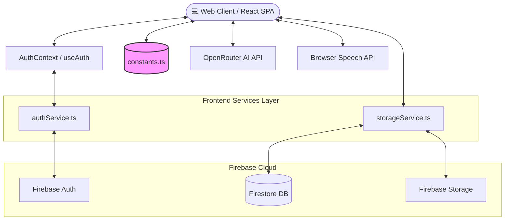

# 🏗️ SkillVerse Architecture & Codebase Guide

Welcome to the **SkillVerse** codebase! This document is designed to help open-source contributors understand how the application is structured, what technologies we use, and critically, how data flows through the app.

---

## 🛠️ Technology Stack

SkillVerse is a modern, client-heavy Single Page Application (SPA). 

- **Frontend Framework:** React 18 (bootstrapped via Vite)
- **Styling:** Tailwind CSS (Dark-mode first, Glassmorphism aesthetics)
- **Routing:** React Router (`react-router-dom`)
- **Backend as a Service:** Firebase (Authentication, Firestore, Storage)
- **AI Engine:** OpenRouter API (utilizing `google/gemini-2.5-flash`)
- **Native APIs:** Browser Web Speech API for Text-to-Speech (TTS) and Speech-to-Text (STT)

---

## 📐 System Architecture Diagram

---

## 📂 Codebase Structure

The project is organized into logical directories within `src/` (or the root directory):

* **`components/`** (UI & Views)
  * Contains all React components, ranging from full-page views to smaller UI elements.
  * *Core Views:* `Dashboard.tsx`, `LandingPage.tsx`, `CareerMode.tsx`, `CourseView.tsx`, `Settings.tsx`
  * *Shared UI (`components/ui/`):* Reusable smaller components like `FeatureCard.tsx`, `BadgeCard.tsx`.
* **`services/`** (Backend Interactions)
  * `authService.ts`: Handles Firebase Authentication workflows (login, signup, password resets).
  * `storageService.ts`: Manages user avatars via Firebase Storage and handles local/remote data syncing for progress.
* **`contexts/` & `hooks/`** (State Management)
  * `AuthContext.tsx`: The source of truth for the current user's session and Firestore profile data.
* **`firebase/`** (Configuration)
  * `firebase.ts`: Initializes the Firebase app, Auth, Firestore, and Storage instances.
* **`constants.ts` & `types.ts`** (Data & Typing)
  * `types.ts`: TypeScript interfaces ensuring type safety across the app.
  * `constants.ts`: **The central hub for all static and mock data (See Below).**

---

## 🔍 The Big Divide: "Real" vs "Mocked" Data

To contribute effectively to SkillVerse, you must understand the distinction between what is currently powered by our real backend infrastructure, and what is currently mocked/simulated on the frontend.

### ✅ Fully Functional (Backed by Firebase & APIs)
These features interact with real external systems or databases:
1. **User Authentication:** Email/Password and Google Sign-in are fully integrated with Firebase Auth. 
2. **User Profiles & Progression:** User settings, XP, daily streaks, levels, and career stats are saved reliably to Firestore DB.
3. **Avatar Uploads:** Uploading profile pictures interacts directly with Firebase Storage.
4. **Live Leaderboard:** Subscribes to real-time Firestore collections (`onSnapshot`) to rank actual users based on XP.
5. **AI Career Mode:** The AI engine sends your live speech to the OpenRouter API and receives real conversational feedback from the Gemini model. Text-to-Speech uses native browser APIs.

### 🚧 Mocked / Simulated (Powered by `constants.ts`)
These features currently rely on client-side hardcoded data or procedural generation. **If you are wondering why there is no API endpoint for fetching courses, this is why!**

1. **The Course Library (`COURSES`):** The entire list of courses is 100% hardcoded in `constants.ts`. 
2. **Course Curriculum:** The actual reading material inside a course is procedurally generated using a generic 8-module template (`generateRichContent`), rather than fetching bespoke markdown.
3. **Quizzes:** Quizzes are generated procedurally (`generateQuiz`) with generic programming questions based on the course topic.
4. **Company List & Questions:** The tech companies in Career Mode (IBM, Intel, etc.) and their technical interview questions (`generateQuestionsForCompany`) are generated deterministically based on tags, rather than being pulled from a database.

> **💡 Note for Future Contributors (Epic):**
> A major long-term goal of the project is to migrate the mocked data in `constants.ts` to Firestore collections so that courses and questions can be managed dynamically without pushing code. 

---

## 🎨 Design Philosophy
* **Dark-Mode First:** The app is designed primarily for dark mode. Light mode is supported but dark mode is the intended default experience.
* **Glassmorphism:** We rely heavily on semi-transparent backgrounds with subtle borders (e.g., `bg-white/5 border border-white/10` or the custom `bg-glass` class) combined with background blurring.
* **Animations:** Use standard Tailwind animations (like `animate-fade-in-up`) for graceful mounts. Avoid jarring transitions.

## 🤝 Getting Started
If you plan to test the AI features locally, ensure you follow the setup instructions in the `README.md` to configure your `VITE_OPENROUTER_API_KEY`. Without it, `CareerMode.tsx` will fail.
